# Conferencia: desarrollo web con Flask y vanilla JS
Universidad de San Carlos de Guatemala <br />
Factultad de ingenieria <br />
Ingenieria en Ciencias y Sistemas <br />
Expositor: José Carlos I Alonzo <br />
Auxiliar encargado: Javier Alejandro Golon <br />
Curso: Introducción a la programación y computación 1
<br /><br /><br />

***
<h1>Tabla de contenidos</h1>

- [**1. Indicaciones**](#1-indicaciones)
- [**2. Herramientas y recursos**](#2-herramientas-y-recursos)
- [**3. Uso local**](#3-uso-local)
- [**4. Manual de S3 (Frontend)**](#4-manual-de-s3-frontend)
- [**5. Manual de maquina virtual (Backend)**](#5-manual-de-maquina-virtual-backend)
<br /><br /><br />

# **1. Indicaciones**
<div style = "text-align: justify;">
El codigo realiza la implementación de un CRUD utilizando la arquitectura cliente - servidor, por medio de las tecnologias de Flask (Python) y los tres pilares del desarrollo web (HTML, css y JavaScript).
Todo el codigo se encuentra comentado en su mayoria, si alguna parte no lo estuviera es por que seguramente se repite el mismo proceso en otra parte del proyecto o considere que es algo que no es tan resaltable o es facil de entender.</div>

<br /><br />

# **2. Herramientas y recursos**
- Lenguaje del backend: [Python](https://www.python.org/)
- Framework del backend: [Flask](https://flask.palletsprojects.com/en/2.0.x/)
- Lenguajes del frontend: HTML, css y JavaScript
- Biblioteca de apoyo visual para el frontend: [Bootstrap](https://getbootstrap.com/)
- Editor de texto: [Visual studio code](https://code.visualstudio.com/)
- Contenido biblbiográfico: [Presentacion](https://view.genial.ly/61317b9a9d48550d72a6e1bf/presentation-conferencia-ipc1-2s2021)
<br /><br />

# **3. Uso local**
<div style = "text-align: justify;">
Tener instalado Python y pip en la computadora, correr los siguientes comandos en consola para instalar flask y flask cors </div>

```python
    # Para Windows: 
    pip install flask flask-cors
    
    # Para Linux:
    pip3 install flask flask-cors
```

<div style = "text-align: justify;">
Para correr el backend, dirigirse a la carpeta servidor y correr el siguiente comando </div>

```python
    # Para Windows: 
    python main.py
    
    # Para Linux:
    python3 main.py
```
<br /><br />

# **4. Manual de S3 (Frontend)**

<div style = "text-align: justify;">
En este manual explicaremos como subir un sitio web estatico hacia el Amazon Simple Storage (S3) de Amazon Web Services (AWS)
</div>
<br />

4.1 Ingresar al sitio web [aws.amazon.com](https://aws.amazon.com/) e iniciar sesion, al iniciar se dirigiran hacia la barra de busqeuda que se encuentra en el centro de la pagina (Imagen 4.1) y buscaremos el servicio **S3** (Imagen 4.2.). 
<br />
<div align="center">

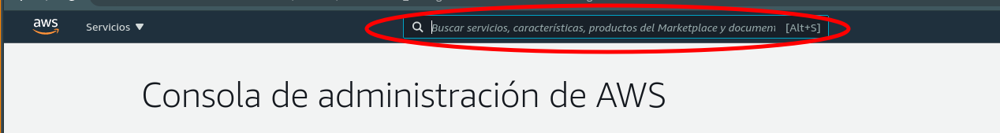

</div>

<p align="center" style="font-size: 15px; font-style: italic;">Imagen 4.1.</p>

<div align="center">

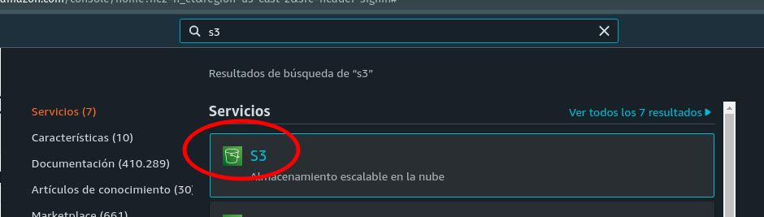

</div>

<p align="center" style="font-size: 15px; font-style: italic;">Imagen 4.2.</p>

<br />

4.2 Ahora ya en la pagina principal de **S3** buscaremos la opción de **Crear Bucket** (Imagen 4.3)


<div align="center">

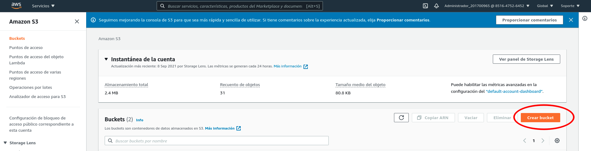

</div>

<p align="center" style="font-size: 15px; font-style: italic;">Imagen 4.3.</p>

<br />

4.3 Ahora crearemos el bucket con las siguiente opciones y lo crearemos.
- ***Nombre del bucket:*** le colocaremos un nombre que no exista previamente, si existiera aws nos lo indicara. (Imagen 4.4)
- ***Bloquear todo el acceso publico:*** Para este caso especial deberemos desmarcar esta opción que viene por defecto y luego marcar que reconocemos lo que estamos haciendo. (Imagen 4.5)

<div align="center">

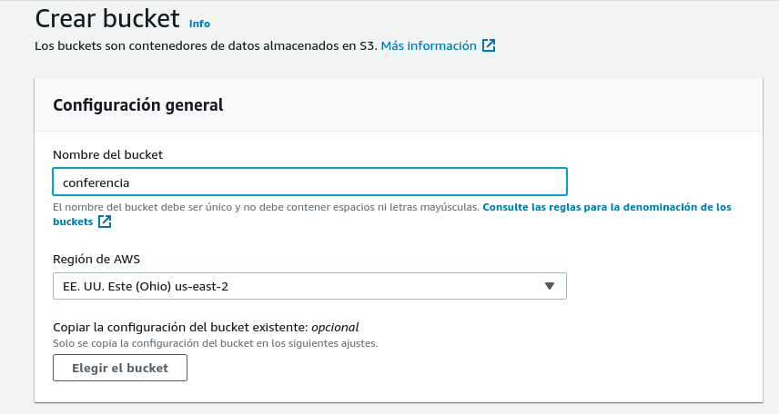

</div>

<p align="center" style="font-size: 15px; font-style: italic;">Imagen 4.4.</p>

<br />

<div align="center">

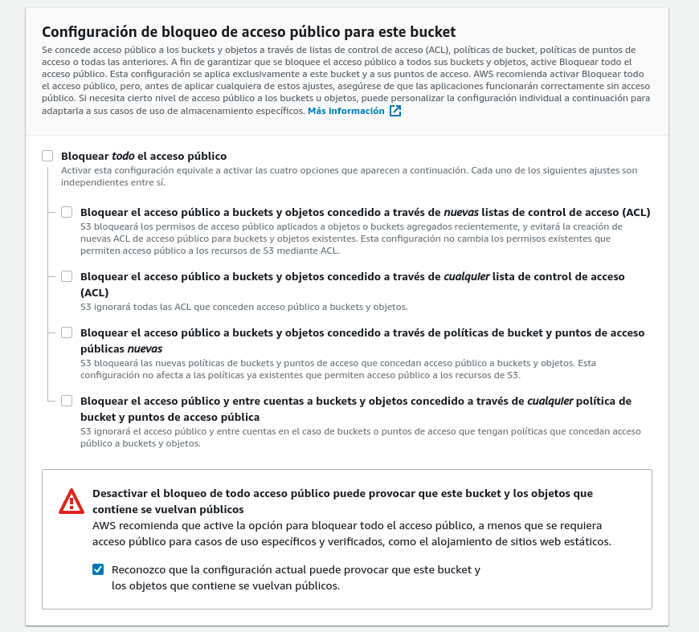

</div>

<p align="center" style="font-size: 15px; font-style: italic;">Imagen 4.4.</p>

<br />

<div align="center">

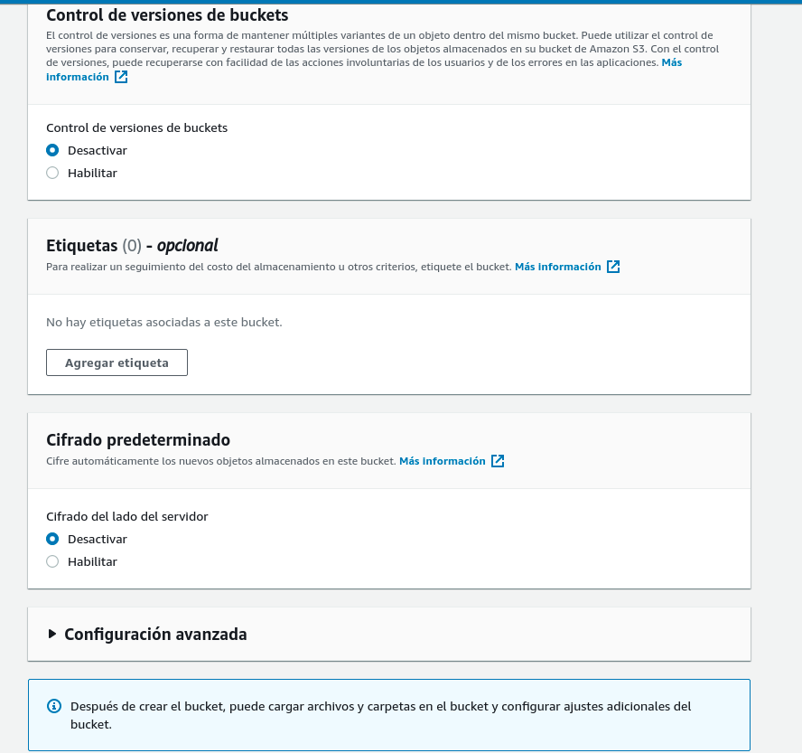

</div>

<p align="center" style="font-size: 15px; font-style: italic;">Imagen 4.6.</p>

<br />

4.4 Ya adentro del bucket nos dirigiremos a la parte de **Propiedades** (Imagen 4.7.) y buscaremos la opción de **Alojamiento de sitios web estaticos** la cual se encuentra hasta el final de este apartado y la editaremos

<div align="center">

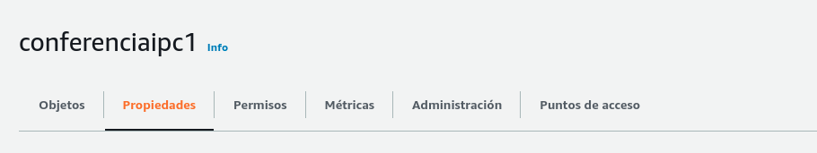

</div>

<p align="center" style="font-size: 15px; font-style: italic;">Imagen 4.7.</p>

<br />

4.5 Ya adentro de dicha opción habilitaremos el almacentamiento de sitios web estaticos e indicaremos nuestra pagina priniciapal que para nuestro el caso de este repositorio **index.html** y guardaremos los cambios (Imagen 4.8)

<div align="center">

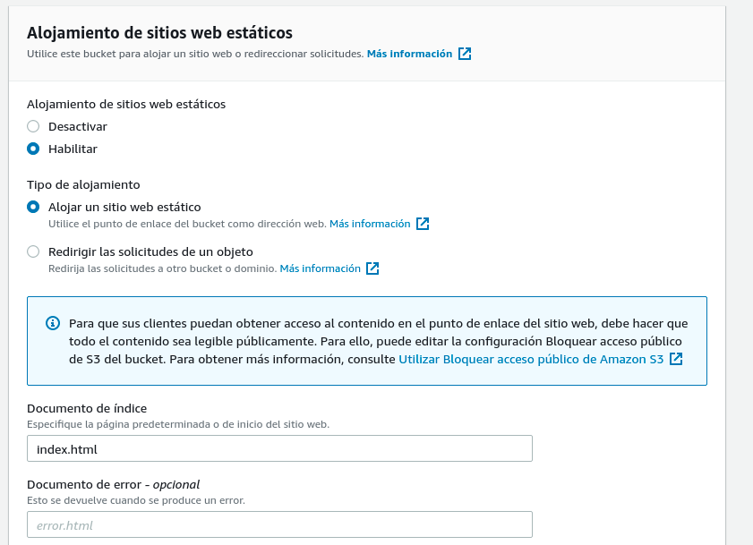

</div>

<p align="center" style="font-size: 15px; font-style: italic;">Imagen 4.8.</p>

<br />

4.6 Ahora nos dirigiremos hacia el apartado de **Permisos** (Imagen 4.9) y buscaremos la opción de **Politica del bucket** y la editaremos.

<div align="center">


</div>

<p align="center" style="font-size: 15px; font-style: italic;">Imagen 4.9.</p>

<br />

4.7 Ya adentro de esta opción copiaremos el siguiente segmento de codigo (Codigo 4.1) en la politica(Imagen 4.10) esto para hacer nuestro sitio web accesible para todos y guardaremos los cambios.

- ***Nota:*** el **/*** debe de ir pegado al nombre del bucket para que funcione. 

```json
{
    "Version": "2012-10-17",
    "Statement": [
        {
            "Sid": "PublicReadGetObject",
            "Effect": "Allow",
            "Principal": "*",
            "Action": [
                "s3:GetObject"
            ],
            "Resource": [
                "arn:aws:s3:::nombre-del-bucket/*"
            ]
        }
    ]
}
```
<p align="center" style="font-size: 15px; font-style: italic;">Codigo 4.1.</p>

<div align="center">

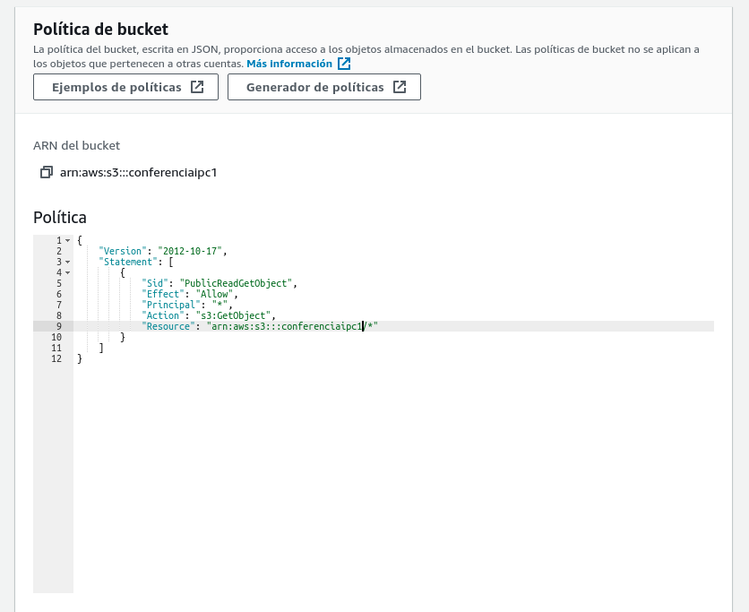

</div>

<p align="center" style="font-size: 15px; font-style: italic;">Imagen 4.10.</p>

<br />

4.8 Ahora nos dirigiremos al apartado de **Objetos** (Imagen 4.11) y buscaremos la opción de cargar (Imagen 4.12), cargaremos los archivos necesarios en **Agregar Archivos** (Imagen 4.13) y los cargaremos (Imagen 4.14).

- ***Nota:*** Antes de subir los archivos debe de haberse cambiado la dirección del **localhost** por la respectiva **ip externa** o **ip publica** de la maquina virtual

<div align="center">

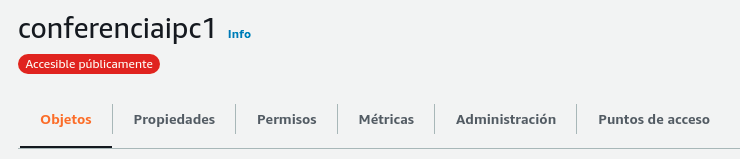

</div>

<p align="center" style="font-size: 15px; font-style: italic;">Imagen 4.11.</p>

<br />
<div align="center">

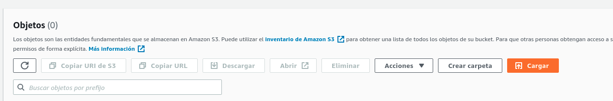

</div>

<p align="center" style="font-size: 15px; font-style: italic;">Imagen 4.12.</p>

<br />
<div align="center">

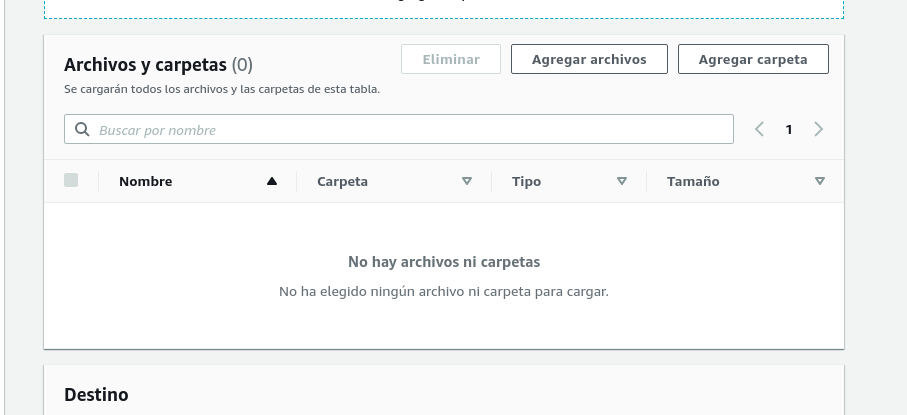

</div>

<p align="center" style="font-size: 15px; font-style: italic;">Imagen 4.13.</p>

<br />
<div align="center">

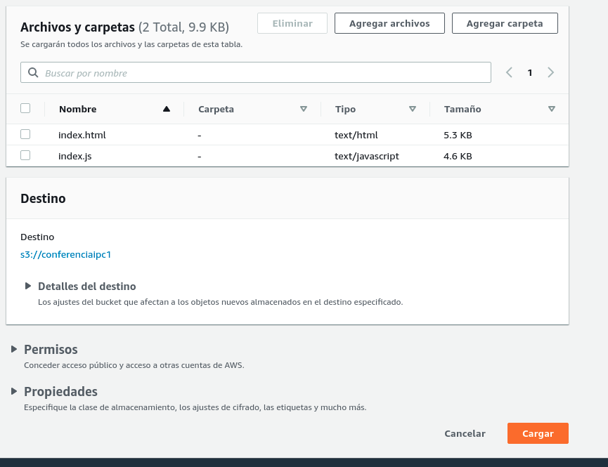

</div>

<p align="center" style="font-size: 15px; font-style: italic;">Imagen 4.14.</p>

<br />

4.9 Ahora nos dirigiremos hacia el apartado de **Propiedades** nuevamente (Inciso 4.4 y 4.5), buscaremos **Alojamiento de sitios web estaticos** y ya podremos visualizar el link hacia nuestro sitio web (Imagen 4.15).

<div align="center">

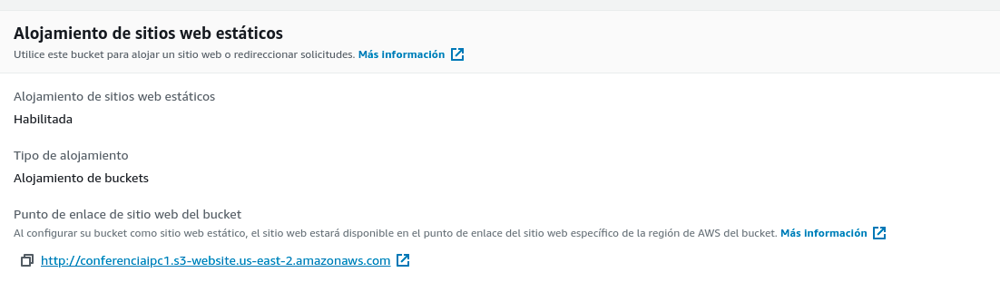

</div>

<p align="center" style="font-size: 15px; font-style: italic;">Imagen 4.15.</p>

<br /><br />


# **5. Manual de maquina virtual (Backend)**
<div style = "text-align: justify;">
En este manual explicaremos como crear una maquina virtual en el proveedor Google Cloud Platform (GCP), configurar politicas para poder comunicarnos hacia la maquina virtual y correr especificamente el proyecto de este repositorio </div>
<br />


5.1. Ingresar al sitio web [CloudGoogle.com](https://cloud.google.com "Cloud Google") e iniciar sesión con cuenta Gmail. En la (Imagen 5.1.) se muestra la barra de navegación donde se debe hacer clic en ***consola*** para ir a la pagina principal de ***Google Cloud Platform*** como se muestra en la (Imagen 5.2.)

<br>

<div align="center">


</div>

<p align="center" style="font-size: 15px; font-style: italic;">Imagen 5.1.</p>

<br>

<div align="center">


</div>

<p align="center" style="font-size: 15px; font-style: italic; ">Imagen 5.2.</p>


<br>

5.2. Para la creación de un nuevo proyecto debemos de ir a la barra de navegación y hacer clic en ***My First Project*** (ver imagen 5.3.).
  - **NOTA**: el nombre de ***My First Project*** puede cambiar si existen otros proyectos creados y se mostrará un nombre aleatorio de los proyectos creados.

<div align="center">


</div>

<p align="center" style="font-size: 15px; font-style: italic; ">Imagen 5.3.</p>

5.3. Se desplegará una nueva tarjeta en donde se pueden ver los proyectos que hayan sido creados y también donde podemos escoger la opción de escoger ***Proyecto Nuevo*** la cual nos interesa y en la cual debemos hacer clic. (Ver imagen 5.4.)


<div align="center">


</div>

<p align="center" style="font-size: 15px; font-style: italic; ">Imagen 5.4.</p>


<br>

5.4. Se desplegará una nueva tarjeta para poder crear nuestro **Proyecto Nuevo**, se debe llenar el formulario, en este caso el nombre del proyecto. El id del proyecto se creará automático al momento de ingresar el nombre de nuestro proyecto, pero si es necesario se puede cambiar. Al haber  completado el formulario, creamos nuestro nuevo proyecto. (Ver Imagen 5.5.)
  - **NOTA**: Para mi caso especial tengo asociada una organización por defecto debido a que la cuenta de google esta creada con mi correo institucional de la universidad, si utilizan una cuenta normal les aparecera **sin organizacion**.
<br>

<div align="center">


</div>

<p align="center" style="font-size: 15px; font-style: italic; ">Imagen 5.5.</p>

<br>

5.5. Luego de haber creado nuestro proyecto, se mostrar una notificacion  y seleccionaremos el proyecto (Imagen 5.6), luego se debe mostrar la interfaz del proyecto (Imagen 5.7).

<br>

<div align="center">


</div>

<p align="center" style="font-size: 15px; font-style: italic; ">Imagen 5.6.</p>

<div align="center">


</div>

<p align="center" style="font-size: 15px; font-style: italic; ">Imagen 5.7.</p>

<br>

5.6. Dirigirse ir al menú desplegable del extremo izquierda de la página del proyecto y seleccionar la opción ***Compute Engine*** y luego la opción ***instancia de VM*** como se muestra en la Imagen 5.*. 
- ***VM*** = Virtual Machine - Máquina Virtual


<br>

<div align="center">


</div>

<p align="center" style="font-size: 15px; font-style: italic; ">Imagen 5.8.</p>

<br>

5.7. Habilitar opción ***Compute Engine API*** como se muestra en la imagen 5.9.

<br>

<div align="center">


</div>

<p align="center" style="font-size: 15px; font-style: italic; ">Imagen 5.9</p>

<br>

5.8.	Luego de concluir la habilitación de la opción de ***Compute Engine API***, se muestra la interfaz de ***Instancias de VM*** Para poder crear una nueva VM en el proyecto. (ver Imagen 5.10.)

<br>

<div align="center">


</div>

<p align="center" style="font-size: 15px; font-style: italic; ">Imagen 5.10.</p>

<br>

5.9. Para crear una nueva Máquina Virtual hacer clic en el botón ***Crear Instancia***. (Ver imagen 5.11.)

<br>

<div align="center">


</div>

<p align="center" style="font-size: 15px; font-style: italic; ">Imagen 5.11</p>

<br>

5.10.	Llenar los campos necesarios del formulario para crear la nueva instancia de VM, en este caso los campos que nosotros llenaremos serán:

- ***Nombre:*** le colocaremos el nombre apropiado a la VM.
- ***Tipo de Máquina:*** seleccionaremos la maquina con los requerimientos mínimos, en este caso será e2-micro (2 CPU virtuales, 1 GB de memoria, ver Imagen 5.12.).
- ***Disco de Arranque:*** debemos escoger el Sistema Operativo para la VM en este caso se escoge una distribución de GNU/Linux. (ver imagen 5.13.)
- ***Firewall:*** habilitaremos ambos protocolos HTTP y HTTPS para la VM. (Ver imagen 5.13.)

Para Finalizar hacer clic en crear.

<br>

<div align="center">


</div>

<p align="center" style="font-size: 15px; font-style: italic; ">Imagen 5.12</p>

<br>

<div align="center">

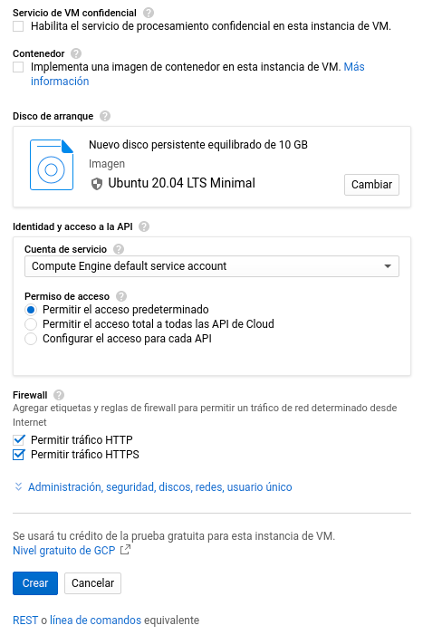

</div>

<p align="center" style="font-size: 15px; font-style: italic; ">Imagen 5.13.</p>


<br>

5.11. Al terminar la creación de la nueva instancia de la VM se muestra en la interfaz de ***Instancias de VM*** una tabla con los datos de esta nueva máquina virtual creada. (Ver imagen 5.14.)

<br>

<div align="center">


</div>

<p align="center" style="font-size: 15px; font-style: italic; ">Imagen 5.14.</p>

<br>

5.12 Luego de haber creado nuestra maquina virtual debemos de habilitar el puerto necesario para poder acceder al servidor, para ellos nos dirigimos al panel desplegable del extremo izquierdo y buscamos la opcion **Red de VPC** y luego la opcion de **firewall** (Imagen 5.15.)
   - ***politicas de FireWall:*** Las políticas del cortafuegos le permiten bloquear o permitir determinados tipos de tráfico de red no especificados en una política de excepciones. Una política también define que funciones del cortafuegos se activan o desactivan. Asigne una política a uno o varios perfiles del cortafuegos.

<div align="center">


</div>

<p align="center" style="font-size: 15px; font-style: italic; ">Imagen 5.15.</p>

<br>

5.13 Ahora nos dirigimos hacia el apartado de **CREAR REGLA DE FIREWALL** (Imagen 5.16.)

<div align="center">


</div>

<p align="center" style="font-size: 15px; font-style: italic; ">Imagen 5.16.</p>
<br />
5.14 Crearemos una regla con las siguientes caracterisiticas (Imagen 5.17. e Imagen 5.18.)

- ***Nombre:*** Cualquier nombre que no exista previamente en las reglas de firewall.
- ***Dirección del trafico:*** Seleccionaremos el trafico de entrada para que podamos consumir el servicio.
- ***Filtros de origen:*** Seleccionaremos **rangos de ip** y en el apartado de **rangos de ip de origen** pondremos **0.0.0.0/0** esto para aceptar la solicitud desde cualquier dirección ip.
- ***Protocolos y puertos:*** Para el caso particular de esta aplicación liberaremos el puerto **3000 tcp**. 

<div align="center">

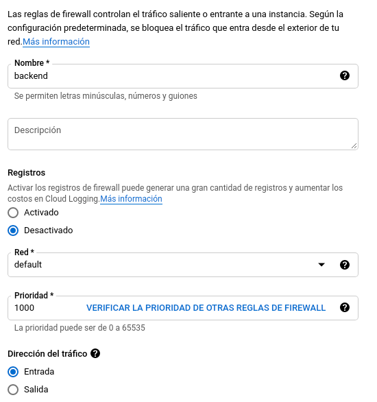

</div>
<p align="center" style="font-size: 15px; font-style: italic; ">Imagen 5.17.</p>

<div align="center">

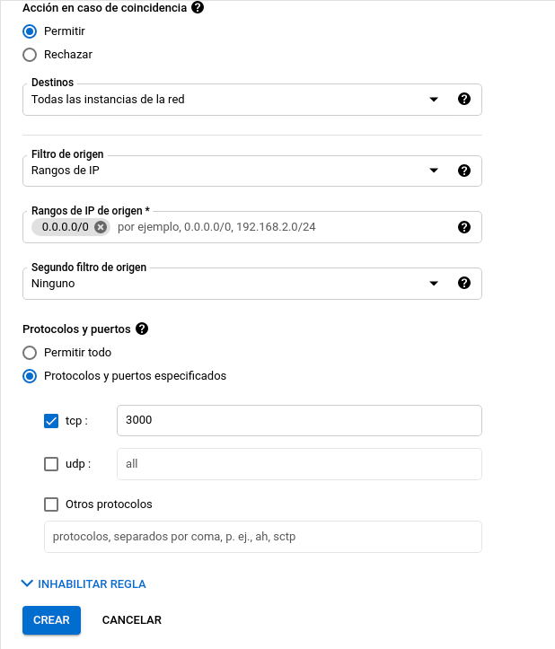

</div>

<p align="center" style="font-size: 15px; font-style: italic; ">Imagen 5.18.</p>

<br>

5.15. Revisar que las politicas se hayan creado y configurado correctamente en la seccion de politicas (ver imagen 5.19).

<div align="center">

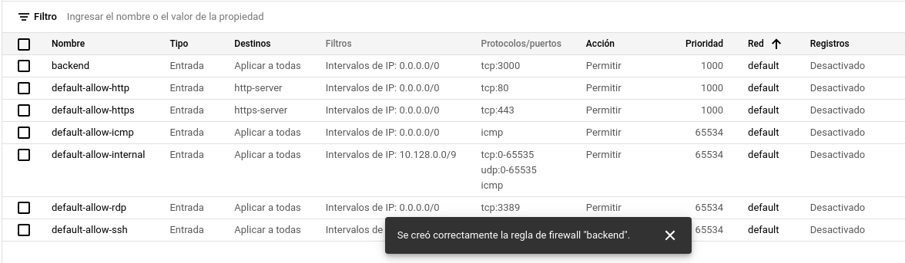

</div>

<p align="center" style="font-size: 15px; font-style: italic; ">Imagen 5.19.</p>
<br />

5.16 Entraremos a la terminal de nuestra maquina virtual (Imagen 5.20.) y correremos los siguiente comandos (Codigo 5.1.)
.
<div align="center">

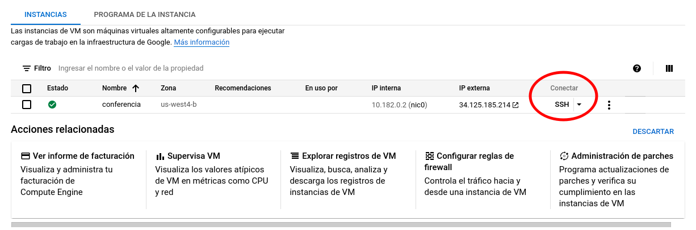

</div>

<p align="center" style="font-size: 15px; font-style: italic; ">Imagen 5.20.</p>

```console
$ sudo apt update
$ sudo apt upgrade
$ sudo apt install git
$ sudo apt install python3-pip
$ sudo pip3 install flask flask-cors
$ git clone https://github.com/JoseTg1904/ConferenciaDesarrolloWeb.git
$ cd ConferenciaDesarrolloWeb
$ cd servidor
$ python3 main.py
```

<p align="center" style="font-size: 15px; font-style: italic; ">Codigo 5.1.</p>

- **NOTA 1:** Estos comandos unicamente funcionan para la imagen de ubuntu, si eligiera otro sistema operativo deberian de buscarse los comandos pertinentes.
- **Nota 2:** El simbolo de dolar no se copia en la terminal, unicamente es un indicativo para separar cada linea de comandos
